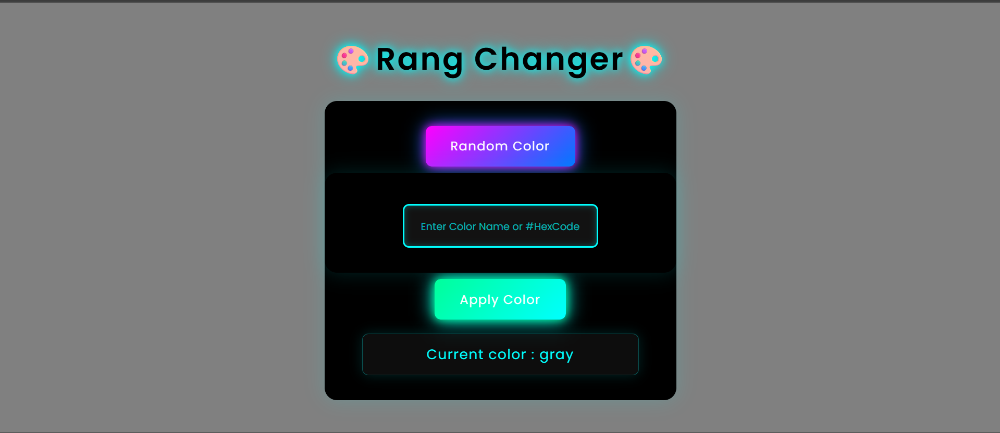
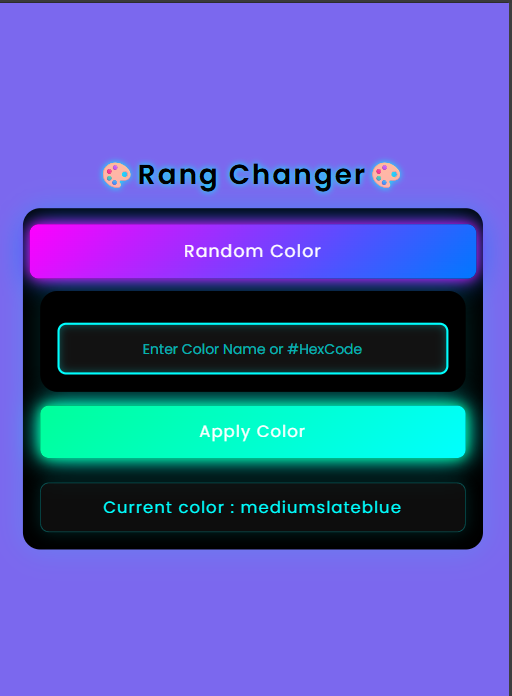

# 🎨 RangChanger  

A simple JavaScript mini-project that lets you change your webpage’s background color — either **randomly** or by **entering a color name / hex code**.  
Live Preview 👉 [RangChanger - Live Site](https://roshan0011830.github.io/rang-changer/)

---

## ✨ Features  

- 🎲 Generate random background colors with one click  
- 🎨 Enter any color name or hex code manually  
- ⚡ Smooth glowing dark UI design  
- 📱 Fully responsive — works perfectly on mobile, tablet & desktop  
- 💡 Smart event handling (Click, Enter key, and Blur event)  
- 🖥️ Shows current color on screen in real-time  

---

## 🧠 Tech Stack  

| Technology | Purpose |
|-------------|----------|
| **HTML5** | Structure |
| **CSS3** | Styling & Responsive Design |
| **JavaScript (Vanilla)** | Logic & DOM Manipulation |

---

## 🧩 How It Works  

1. **Random Color** → Click the "Random Color" button to instantly apply a random shade.  
2. **Custom Input** → Type a color name (like `blue`, `coral`) or hex code (`#ff6600`) and click "Apply Color".  
3. **Display Section** → Shows the currently active background color.  

---

## 🖼️ Screenshots  

### 💻 Desktop View  
  

### 📱 Mobile View  
  

*(💡 Replace the image paths with your actual screenshots once added.)*  

---

## 🚀 Quick Start  

```bash
# Clone the repository
git clone https://github.com/roshan0011830/Rang-Changer.git

# Open the folder
cd Rang-Changer

# Run in browser
open index.html   # or use Live Server in VS Code
